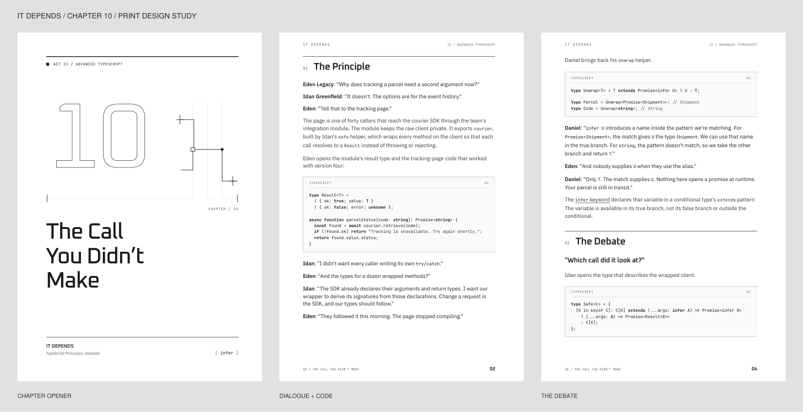

# Print design study

A minimal sci-fi direction for **It Depends — TypeScript Principles, Debated**.
The study renders the complete Chapter 10 in 6 × 9 and 7 × 10 inches. It reads
the manuscript directly; it does not maintain a second copy of the chapter.

**Working format: 7 × 10 inches.** The author approved the visual direction and
preferred this size after reviewing both samples. Keep 6 × 9 as a comparison.
The chapter opener is approved as a direction; final pagination still needs a
full-book pass.

Pagination should flow automatically with editorial constraints: headings stay
with a meaningful opening passage, short code examples stay together with their
introductions, and short dialogue turns stay together. Avoid isolated lines at
page boundaries. Review longer examples for sensible breaks and inspect every
spread once the manuscript is stable. The current template implements initial
keep-together rules; these do not replace that final review.

## Review the samples

These saved snapshots capture the September 24, 2026 design study:

- [7 × 10 PDF — working format](samples/chapter-10-7x10.pdf)
- [6 × 9 PDF — comparison](samples/chapter-10-6x9.pdf)



The build writes to `output/`; it does not replace these review snapshots.
Refresh the snapshots deliberately when a new design is approved.

## Direction

- **Oxanium** gives chapter openers and headings their angular character.
- **IBM Plex Sans** carries the dialogue and narration.
- **JetBrains Mono** carries the code and small navigation labels.
- Outlined chapter numbers, a restrained branching-line motif, and fine rules
  provide the visual identity. The reading pages stay mostly white.
- The interior is monochrome. Syntax remains legible without relying on color.
- Code is selectable text. Long lines wrap with a hanging indent; the source
  is unchanged. Example numbers are local to this design study.
- The chapter's linked sources are also listed with their URLs at the end so
  they remain accessible in a printed copy.

## Build

Python 3 and Google Chrome are needed. From the repository root:

```sh
python3 -m venv design/print/.venv
design/print/.venv/bin/pip install -r design/print/requirements.txt
design/print/.venv/bin/python design/print/build.py
```

On other platforms, pass `--chrome /path/to/chrome`. `--html-only` creates the
HTML without launching a browser. Rendering uses an isolated temporary Chrome
profile, bundled fonts, and local HTML. No manuscript is uploaded.

Generated PDFs, HTML, page images, and verification notes go in `output/`
(ignored by Git). Open `preview.html` after building. The HTML chapter files
are continuous screen previews; the PDFs are the authoritative paginated samples.
Browser versions can change pagination, so compare the rendered pages when
updating Chrome.

The build checks page dimensions, font embedding, all 20 code-block labels, and
the final dialogue. The page PNGs support visual inspection. These checks do not
replace checking pagination and readability by eye, or ordering a physical proof.

## Print assumptions

These are **design samples**, not the final publication files. They use supported
KDP trim sizes, single pages, embedded fonts, and no bleed. Page numbers start at
1 within the sample; front matter, final running heads, and book pagination still
need to be integrated. The inside margins are provisional: confirm the gutter
against the full book's page count and binding before submission. Cover dimensions
and spine design also wait for the final page count and paper choice.

KDP references:

- [Manuscript and cover file requirements](https://kdp.amazon.com/en_US/help/topic/G201857950)
- [Trim size, bleed, and margins](https://kdp.amazon.com/en_US/help/topic/GVBQ3CMEQW3W2VL6)
- [Printing cost and trim-size categories](https://kdp.amazon.com/en_US/help/topic/G201834340)

## Fonts

Bundled under the SIL Open Font License, with each license in `fonts/`:

- [Oxanium](https://github.com/sevmeyer/oxanium/tree/master/fonts/ttf)
- [IBM Plex Sans](https://github.com/IBM/plex/tree/master/packages/plex-sans/fonts/complete/ttf)
- [JetBrains Mono](https://github.com/JetBrains/JetBrainsMono)

The files were downloaded from those official repositories on September 24,
2026. Keeping the exact font files here makes subsequent renders independent of
changes to the upstream fonts.
